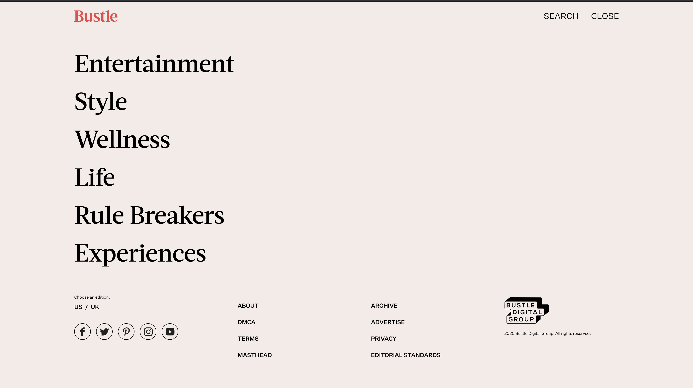

### DH150-WESLEYC
Week 2 Discussion
The following analyzes th hueristics of two sites for middle-aged women. 
Through this evaluation of hueristics, it is possible to create a site that is more easily navigable for the in-user and their desires when viewing the webpage. 

## Website 1 : Bustle. com
https://www.bustle.com/

1. visibility of system status
2. Match between system and the real world
3. User control and freedom
4. Consistency and standards
- When looking at the Bustle page and going into the menu, on the left side of the page are various topics, such as: Entertainment, Style, Wellness, Life, Rule Breakers, and Experiences. This seems to be a poor User interface, becuase some of these categories do not have universal approaches. They imply that "Life" for one user may look the same for another or "Rule Breakers" seems ambiguous. 

5.Error prevention
6. Recognition rather than recall
7. Flexibility and efficiency of use
8. aesthetic and minimalist design (poor)
9. Help users recognize, diagnose, and recover from errors
10. Help and documentation
## Website 2: Oprah.com
https://www.oprah.com/index.html
